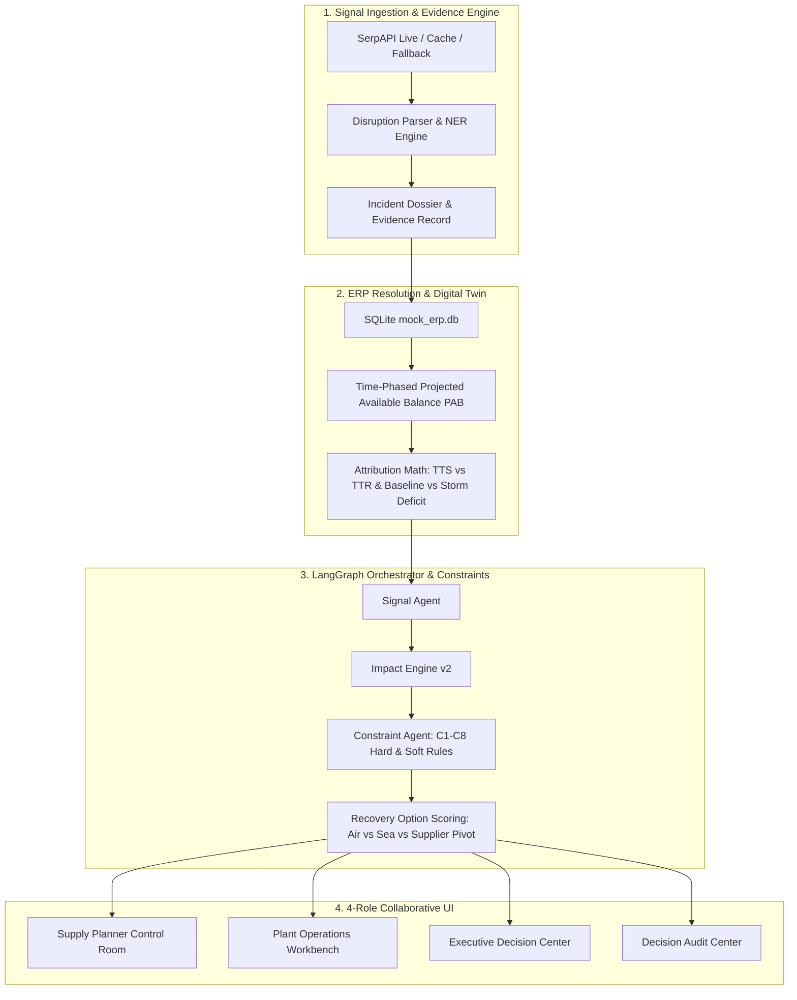

# APEXX Autonomous Supply Chain Control Tower

> **Enterprise Disruption Resolution & Autonomous ERP Control Tower**  
> Powered by SerpAPI Google News Signal Discovery, LangGraph Multi-Agent Orchestration, Deterministic Impact Math Engine, and Figma-Accurate 4-Role Enterprise UI.

---

## 🌟 Executive Overview

APEXX Autonomous Supply Control Tower bridges real-world supply chain disruptions (macro-geopolitical crises, typhoons, port congestions, labor strikes) to enterprise MRP/ERP manufacturing schedules. It automates disruption detection, evaluates BOM & OTIF contract exposures, runs deterministic constraint-rule validation (C1–C8), and enables role-based collaborative decision workflows for Supply Planners, Plant Operations, VP Executives, and Audit Governance teams.

---

## 🏛️ System Architecture



---

## 👥 Four Enterprise Role Workspaces

### 1. 🎛️ Supply Planner Control Room (`PLANNER`)
* **Interactive Digital Twin Simulation:** Real-time delay slider (0–20 days) dynamically recalculating stockout dates, daily burn rates, and shortage gaps.
* **Time-Phased Projected Available Balance (PAB):** 21-day timeline tracking gross requirements, scheduled receipts, planned stock, and stockout transitions.
* **Recovery Options Evaluation:** Side-by-side comparison of expediting candidates with cost-benefit analysis.

### 2. 🏭 Plant Operations Workbench (`PLANT_LEAD`)
* **Shop Floor Work Order Tracking:** Work order status (`WO-7790`, `WO-7782`, `WO-7795`), parent subassembly linkage, and product delivery schedules.
* **Line Readiness & Shift KPIs:** Line 1 (Heavy Drives), Line 2 (Traction Inverters), Line 3 (High Voltage Assembly) allocation tracking.
* **Operational Drawers & Deviation Filing:** Direct access to material allocation drawers, component bills, and supervisor deviation sign-offs.

### 3. 💼 Executive Decision Center (`VP`)
* **Financial Exposure & ROI Trade-off:** Side-by-side comparison of **$135,000 OTIF penalty risk** vs **$26,000 expediting recovery cost** (Net Value Preserved: **$109,000**).
* **Rule C5 Spend Authority Gate:** Enterprise governance threshold requiring VP Supply Chain sign-off for expenditures > $30,000.
* **One-Click Autonomous PO Execution:** Issues formal purchase orders (`PO-EURO-75256`), updates ERP state, and notifies suppliers.

### 4. 🛡️ Decision Audit & Governance Center (`AUDIT`)
* **9-Point Explainability Proof Chain:** Comprehensive data-derived narrative detailing exact disruption route, affected component, customer contract, and rule validation.
* **C1–C8 Deterministic Constraint Matrix:** Transparent breakdown of Lead Time, MOQ, PPAP Quality, Frozen Window, Spend Gate, BOM Revision, Trade Sanctions, and Supplier Capacity.
* **Immutable SQLite Ledger & SOX-404 Compliance:** Full cryptographic-grade audit logs with JSON evidence export.

---

## 🚦 Live Disruption Scenarios

| Scenario | Incident ID | Disruption Event | Material | Work Order | Impact & Behavior |
| :--- | :--- | :--- | :--- | :--- | :--- |
| **Critical Shortage** | `INC-SHIP-8100` | Red Sea Houthi attacks rerouting Bab-el-Mandeb | `CTRL-MOD-800` (Control Module) | `WO-7790` (Siemens Energy Mobility) | **CRITICAL:** 13-day net shortage, **$135,000** OTIF penalty risk. Triggers OPT-A air freight expediting. |
| **Port Congestion** | `INC-SHIP-9200` | Ningbo Port typhoon berth congestion | `ROTOR-220` (Precision Rotor) | `WO-7795` (GE Systems) | **HIGH:** 7-day delay, **$95,000** OTIF penalty exposure. Triggers alternate supplier routing. |
| **Buffer Absorbed** | `INC-SHIP-6205` | Nachi Bearing customs clearance delay | `BEARING-6205` (Roller Bearing) | `WO-7710` (Internal Stores) | **ABSORBED:** TTS (20.0d) > TTR (15d). On-hand inventory absorbs delay. **$0.00** contract risk. |

---

## 📐 Deterministic Constraint Rulebook (C1–C8)

* **C1: Supplier Lead Time** — Required delivery date must satisfy minimum manufacturing & transit lead times.
* **C2: Minimum Order Quantity (MOQ)** — Order lot sizes must meet or exceed vendor minimums.
* **C3: PPAP Quality Certification** — Critical automotive & industrial parts require Level 3 PPAP approval.
* **C4: Frozen Manufacturing Window** — Schedule changes within the 48-hour frozen window require plant authorization.
* **C5: Spend Authority Gate** — Expediting costs exceeding $30,000 require VP Supply Chain approval.
* **C6: BOM Revision Match** — Component revisions must strictly match product design engineering revisions.
* **C7: Export / Trade Sanctions** — Suppliers and freight lanes must clear OFAC and export control checks.
* **C8: Supplier Production Capacity** — Sourced volume cannot exceed 85% of total supplier monthly capacity.

---

## 🚀 Quick Start Guide

### Prerequisites
* Python 3.10+
* Node.js 18+ and npm

### 1. Backend Setup
```bash
# Navigate to repository root
python -m venv venv
venv\Scripts\activate   # On Windows
# source venv/bin/activate # On Linux/macOS

# Install dependencies
pip install flask flask-cors requests python-dotenv

# Run all test suites
python run_all_tests.py

# Start Flask API server (runs on http://localhost:5000)
python server.py
```

### 2. Frontend Setup
```bash
# Navigate to frontend directory
cd frontend

# Install npm dependencies
npm install

# Start Vite dev server (runs on http://localhost:5173)
npm run dev
```

---

## 🧪 Master Test Suite Verification

Run the unified acceptance test suite across all 4 project days:
```bash
python run_all_tests.py
```
Output:
```text
======================================================================
                    FINAL VERIFICATION SUMMARY
======================================================================
  [PASS]   | Day 1: Evidence Search & Multi-Source Ranking
  [PASS]   | Day 2: Generalized Dynamic BOM & Dual Scenarios
  [PASS]   | Day 3: Explainability & SQLite Audit Persistence
  [PASS]   | Day 4: Full E2E Workflow & Guardrail Boundaries
  [PASS]   | Integration: Phase 2 API Server Endpoints
======================================================================
  ALL TEST SUITES PASSED! System is 100% ready for demo judging.
======================================================================
```
